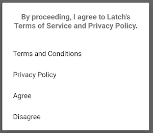
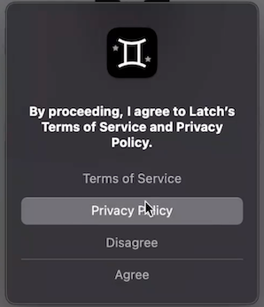

# Partner App

Responsible for hosting the Latch IOS/ADR SDK.

## User Consent

To utilize Latch Services, all users must adhere to and accept Latch Terms of Service and Privacy Policies. This applies to users of the Latch App on all platforms including users of any Partner App that utilizes the Latch SDK.

The Latch SDK will display a system-level dialog requesting the user’s consent to the Latch [Terms of Service](https://www.latch.com/terms-of-service) and [Privacy Policy](https://www.latch.com/privacy-policy). The dialog will provide links to [latch.com](http://latch.com/) where the user can review the Terms of Service and Privacy Policy. The user will have the opportunity to Agree or Disagree with the Latch terms. If the user agrees to the terms the SDK will continue to function as intended and provide the ability to Unlock. 

The user’s acceptance will be needed by the Latch SDK where it will be securely stored and transmitted to the Latch BE for permanent persistence. The SDK will look for the user’s acceptance and consent either locally or from the Latch BE and will not fulfill any requests from the Partner App until the User Acceptance has been provided or retrieved from persistence. 

> The consent will be gathered only once from the End User, not per device. 

<table>
<tr> 
<th>Android dialog</th>
<th>iOS dialog</th>
</tr> 
<tr> 
<td></td>
<td></td>
</tr>
</table>

## Supported Platforms

The Latch SDKs will support the following versions of IOS and Android. Post the Beta period, all versions of IOS/Android currently supported by the Latch App will also be supported.

| Platform | SDK Beta          |
| -------- | ----------------- |
| iOS      | Current to iOS 13 |
| Android  | Current to ADR 8  |

## Communications

The Latch SDK will execute its own communication protocol with Latch services and fetch the relevant information to allow Partner Apps to build a list of Doors and Locks. All fetched information will be directly stored in the mobile storage. The Latch SDK will internally manage its own encrypted database storage. Typical storage needs for the Latch SDK should not exceed 10MB.

## Bluetooth

Beyond standard internet-based connectivity requirements, the Latch SDK heavily utilizes Bluetooth protocols to communicate with Latch Lock devices. The Partner App will not need to implement BT on its own as the Latch SDK will encapsulate all necessary protocols and be responsible for scanning for a device, connecting to a device, setting up a device, and unlocking a device. 

The Partner App however will need to ensure users have granted appropriate permissions to Bluetooth (iOS and Android) for the Partner App. Without these permissions granted, the Latch SDK will not be able to function.

## Permissions

The Latch SDK requires specific permissions from the user in order to function properly. The SDK will ask for these permissions upon initialization. As an example, if the user chooses to disable the BLE permission, the SDK will throw a BlePermissionNotGranted error for the App to handle when the user attempts to unlock a door. At this point, the App can choose to reinitialize the SDK so permissions can be requested by the SDK.

The following are a list of permissions that the SDK requests from the user:

* Bluetooth
* Location service (for older Android versions)

## Setup and Initialization

```
initialize(token)
```

Initializes the Latch SDK. The Latch SDK requires the current user to agree to Latch's Terms & Conditions and Privacy Policy. If the current user has not granted permission, a modal system alert will be presented to request permission.

**Parameters**

* `token`: Authorization token for the current user.

**Returns**

* On success returns Void. Otherwise, throws an error.

All additional SDK functions require that `initialize(...)` has been invoked with a valid token. If the SDK hasn’t been properly initialized, then requests to the SDK will return an `unauthenticated` error. Partner App can receive the error, supply a new token, and then continue to use the SDK functions.

**Errors**

| Code                          | Description |
| ----------------------------- | ----------- |
| `LatchError.invalidToken`     | The supplied authorization token is invalid and should be refreshed. |
| `LatchError.permissionDenied` | The current user hasn't granted the app access to use the Latch SDK. |
| `Error`                       | An unexpected error occured |

## Doors and Locks

```
locks()
```

Retrieve all locks accessible to the current user. This list can be used to build out a UI/UX flow however the Partner deems necessary. 

**Returns**

* On success returns a collection of `Lock`. Otherwise, throws an error.

`Lock`

| Name   | Type   | Description |
| ------ | ------ | ----------- |
| `id`   | UUID   | Unique Identifier |
| `name` | String | Name of the lock/door |

**Errors**

| Code    | Description |
| ------- | ----------- |
| `Error` | An unexpected error occured |

## Unlock

```
unlock(uuid)
```

Use BLE to scan for a specific Latch device and explicitly unlock the device.

Performing BLE operations requires the user to grant the app permission to use native Bluetooth APIs. This will result in a system modal to be presented on first use.

**Parameters**

* `uuid`: The uuid of the Lock (device) to start scanning for and Unlock.

**Returns**

Either a success or failure.

**Remarks**

`Unlock(lock)` has been deprecated. 

**Errors**

| Code                                    | Description |
| --------------------------------------- | ----------- |
| `LatchError.bluetoothDisabled`          | The current device does not have Bluetooth enabled. |
| `LatchError.permissionDenied`           | User denied Latch SDK access to use the device's Bluetooth. |
| `LatchError.concurrentUnlockInProgress` | Only one unlock operation is allowed at a time. |
| `LatchError.lockNotFound`               | Failed to find a lock with a unique identifier matching the given lock ID. |
| `LatchError.timeout`                    | Unlock failed to complete in a reasonable amount of time. |
| `Error`                                 | An unexpected error occured | 


