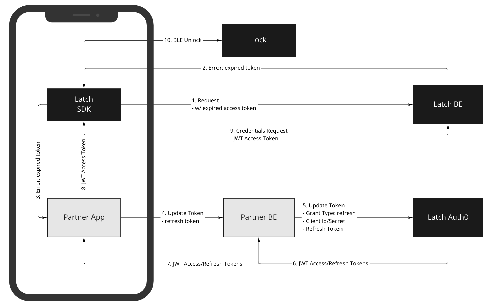

# Partner Backend

Latch will provide Partners with a unique [Auth0 app](https://auth0.com/docs/get-started/applications) that will only be accessible to the Partner’s BE through whitelisted IP addresses. 

## IP Allowlist

Each Partner will be expected to provide a set of **static** IPs that will be added to our allowlist by Latch’s Auth system. Requests for authorization tokens for the Partner not originating from the whitelisted IPs will be rejected with an HTTP status code 403.

Partners are expected to provide IP addresses for Production and Staging environments to Latch manually (email, for ex). Lower-level environments will be granted on a case-by-case basis and only for a limited amount of time.


## Client Id and Client Secret

These are unique values provided by Latch to the Partner through secure and encrypted channels. It is the Partner’s responsibility to securely store the Client Id and Client Secret so that it is only used when communicating with the Latch Auth0 app. 

There will be 2 sets of Client Id and Client Secret, each one for different use cases:

* User-scoped credentials (passwordless)
  * These credentials are used to create **user-scoped tokens** (see "Authorization Token" section below) and then use that token to make calls from the SDK.
  * In this documentation, we'll refer to them as `{{passwordless_client_id}}` and `{{passwordless_client_secret}}`.
* Partner-scoped credentials (machine-to-machine)
  * These credentials are used to create partner-scoped tokens (see "Authorization Token" section below) and then use that token to make calls for non-user related actions (e.g. for the User Kit APIs).
  * In this documentation, we'll refer to them as `{{m2m_client_id}}` and `{{m2m_client_secret}}`.
  * **Note:** These credentials are also used to generate the user tokens, which are expected to be replaced by passwordless tokens.

In both cases, these credentials are only to be used from the Partner Backend.

Latch reserves the right to rotate the Client Secret in the future and will coordinate with the partner to update it.

## Authorization Token

All the interactions between the Partner BE or Partner app and Latch BE must contain a [JWT token](https://auth0.com/docs/secure/tokens/json-web-tokens) that represents the partner and the scope of permissions. There are 2 type of tokens:

* User-scoped
* Partner-scoped

Depending on the API used and whether the API call is done on behalf of the user or not, the partner should use the corresponding token.

The Partner BE will be responsible for communicating to the Latch-provided Auth0 service to retrieve an authorization token. This token will need to be passed down through the Partner App to the Latch SDK. 

### User-scoped Tokens

**These tokens allow partners to make API calls on behalf of an end-user.**

The user email is provided by the Partner App to the Partner BE and sent along with the Client Id and Client Secret to the Latch Auth0 app. The provided email address is for the user attempting to utilize the Partner App to unlock a Latch device. 

For the Latch Auth0 App to generate a proper token, the user must already be provisioned within the Latch ecosystem, associated with the Partner, and granted access by the Partner or Latch to specific Doors.

The User’s relationship to the Partner is verified by the Latch Authentication service and both the User ID and Partner ID are returned as [claims](https://auth0.com/docs/secure/tokens/json-web-tokens/json-web-token-claims) in the JWT token. Each token returned by the Latch Auth0 App is scoped to a specific User and Partner.

> The Latch Auth0 App does not require that a password is provided for the Latch user account. Therefore a password for the user is not to be collected or transmitted by the Partner App to the Latch Auth0.   

### Partner-scoped Tokens

**These tokens can be used to make API calls that are not operating on behalf of the end-user.**

Partner BE sends the Client Id and Client Secret to the Latch Auth0 app, without including a user email, and the Partner ID is returned as a [claim](https://auth0.com/docs/secure/tokens/json-web-tokens/json-web-token-claims) in the JWT token. Each token returned by the Latch Auth0 App is scoped to a specific Partner.

## Authorization Token Generation

### User-scoped tokens

As part of the authorization request, the user will need to be identified through an email based verification code. 

To obtain a token from the Latch Auth0 App, the following steps need to be executed as demonstrated in the above diagram:

1. Partner App obtains the IP (IPv4) address from the Device and the email of the logged in User and sends that to the Partner BE.
1. POST from Partner BE, to the Latch Auth0 App with the following
	
	```
	POST https://auth.prod.latch.com/passwordless/start
	```

	HTTP Request Headers

	```
	auth0-forwarded-for: {{user_ip}}
	```

	HTTP Request Body

	```
	{
	    "client_id": "{{passwordless_client_id}}",
	    "client_secret": "{{passwordless_client_secret}}",
	    "email": "{{user_email}}",
	    "connection": "email",
	    "send": "code"
	}
	```

	HTTP Response Body

	```
	{
	    "email": "<string>",
	    "email_verified": <bool>
	    "_id": "<string>",
	}
	```

1. If the Request is successful, Latch Auth0 app, will send a Verification Code to the user’s email and return an HTTP 200 with the following fields:
	* `email`: User email (same as the email provided in the HTTP request).
	* `email_verified`: Unused field.
	* `_id`: Unused field.

	In case of an error, the API will return an HTTP 400 and a status in the "error_description" field:
	
	* `BAD_REQUEST`: Missing "email" parameter.
	
		⇒ Check the API request to make sure all fields have been populated.
		
	* `UNAUTHORIZED`: Email account is not authorized or doesn't exist.

		⇒ Check if the email has been configured in Manager Web.
		
	* `USER_ACCOUNT_NOT_ACTIVE`: Email account exists, but is not active.

		⇒ Contact Latch Support to check the status of the user account.

	* `INTERNAL_SERVER_ERROR`: There was an unexpected error.

		⇒ Contact Latch Support to help debug this issue.

1. The Partner App will need to provide UI for the user to input the Verification Code from the user’s email.

1. The Partner App will need to send the User email address and the Verification Code to the Partner BE.

1. POST from the Partner BE, to the Latch Auth0 App with the following

	```
	POST https://auth.prod.latch.com/v1/oauth/token
	```
	
	HTTP Request Body
	
	```
	{
	    "client_id": "{{passwordless_client_id}}",
	    "client_secret": "{{passwordless_client_secret}}",
	    "otp": "{{verification_code}}", 
	    "username": "{{user_email}}", 
	    "audience": "https://rest.latchaccess.com/access/sdk", 
	    "grant_type": "http://auth0.com/oauth/grant-type/passwordless/otp", 
	    "realm": "email", 
	    "scope": "openid profile email offline_access"
	}
	```

	HTTP Response Body

	```
	{
	    "access_token": "<string>",
	    "refresh_token": "<string>",
	    "expires_in": <int>,
	    "token_type": "Bearer",
	    "scope": "openid profile email offline_access",
	    "id_token": "<string>"
	}
	```

1. If the request was successful, an HTTP 200 will be returned with the following fields:
	* `access_token`: User-scoped access token the Partner BE should send to the Partner App so it can initialize the SDK.
	* `refresh_token`: Refresh token the Partner BE should store to use later during the token refresh flow, once the Access token expires.
	* `expires_in`: Time-to-live of the access token, in seconds. After this amount of time, the given access token will no longer be valid.
	* `token_type`: Auth scheme to use (will always be "Bearer").
	* `scope`: List of scopes included in the token (same as the value provided in the HTTP request.
	* `id_token`: Unused field.

	In case of an error, the API will return an HTTP 500 and a status in the "error_description" field:

	* `BAD_REQUEST`: Missing "email" parameter.

		⇒ Check the API request to make sure all fields have been populated.
		
	* `UNAUTHORIZED_API`: Missing or invalid "audience" parameter.

		⇒ Check the API request to make sure the "audience" field has the right value.
	
	* `UNAUTHORIZED`: Email account is not authorized or doesn't exist.

		⇒ Check if the email has been configured in Manager Web.

	* `USER_ACCOUNT_NOT_ACTIVE`: Email account exists, but is not active.

		⇒ Contact Latch Support to check the status of the user account.

	* `INTERNAL_SERVER_ERROR`: There was an unexpected error.

		⇒ Contact Latch Support to help debug this issue.

### Partner-scoped tokens

To obtain a token from the Latch Auth0 App, the following steps need to be executed as demonstrated in the above diagram:

1. POST from the Partner BE, to the Latch Auth0 App with the following

	```
	POST https://auth.prod.latch.com/v1/oauth/token
	```
	
	HTTP Request Body
	
	```
	{
	    "client_id": "{{m2m_client_id}}",
	    "client_secret": "{{m2m_client_secret}}",
	    "audience": "https://rest.latchaccess.com/access/sdk", 
	    "grant_type": "client_credentials", 
	}
	```

	HTTP Response Body
	
	```
	{
	    "access_token": "<string>",
	    "expires_in": <int>,
	    "token_type": "Bearer"
	}
	```

1. If the request was successful, an HTTP 200 will be returned with the following fields:
	* `access_token`: Partner-scoped access token the Partner BE should store to use in all future API requests.
	* `expires_in`: Time-to-live of the access token, in seconds. After this amount of time, the given access token will no longer be valid.
	* `token_type`: Auth scheme to use (will always be "Bearer").

	In case of an error, the API will return an HTTP 500 and a status in the "error_description" field:
	
	* `UNAUTHORIZED_API`: missing or invalid "audience" parameter.

		⇒ Check the API request to make sure the "audience" field has the right value.

	* `INTERNAL_SERVER_ERROR`: there was an unexpected error.

		⇒ Contact Latch Support to help debug this issue.

## Token Expiration

### User-scoped tokens

The JWT token provided to the Partner BE from the Latch Authentication service will expire within 24 hours. Invoking Latch SDK functions with an expired token will raise a `TOKEN_EXPIRED` exception by the SDK. This exception should be handled by the Partner App and should serve as a signal to retrieve a new token through the Partner BE and Latch Auth0 service. 

Ideally, the Partner App should retrieve a new token before the current one’s expiration to reduce end-user perceived app latency and improve the overall experience. 

> A user will be able to unlock a door through a BLE Credential even after the Auth Token has expired. 

### Partner-scoped tokens

The JWT token provided to the Partner BE from the Latch Authentication service will expire within 24 hours. Invoking OpenKit APIs with an expired token will return a 403 Forbidden HTTP error and the partner BE should initiate the token authorization flow again (as described above).

## Refresh Token 

<table>
<tr><td></td></tr>
</table>

The Refresh Token ensures the user does not have to be issued a Verification repeatedly and must be implemented by the Partner App and BE. When the Latch SDK makes a request with an expired Access Token, the Latch BE will throw an error that can be captured by the Partner App to begin the Refresh Token flow.

1. Partner App requests from the Partner BE a new Access Toke

1. POST from the Partner BE to the Latch Auth0 App

	```
	POST https://auth.prod.latch.com/v1/oauth/token
	```

	HTTP Request Body
	
	```
	{
	  "client_id": "{{passwordless_client_id}}",
	  "client_secret": "{{passwordless_client_secret}}",
	  "audience": "https://rest.latchaccess.com/access/sdk",
	  "grant_type": "refresh_token",
	  "refresh_token": "string",
	}
	```

	HTTP Response Body
	
	```
	{
	    "access_token": "<string>",
	    "refresh_token": "<string>",
	    "expires_in": <int>,
	    "token_type": "Bearer",
	    "scope": "openid profile email offline_access",
	    "id_token": "<string>"
	}
	```

1. If the request was successful, an HTTP 200 will be returned with the following fields (same as the request to obtain a new Auth token, as described above):

	* `access_token`: User-scoped access token the Partner BE should send to the Partner App so it can initialize the SDK.
	* `refresh_token`: Refresh token the Partner BE should store to use later during the token refresh flow, once the Access token expires.
	* `expires_in`: Time-to-live of the access token, in seconds. After this amount of time, the given access token will no longer be valid.
	* `token_type`: Auth scheme to use (will always be "Bearer").
	* `scope`: List of scopes included in the token (same as the value provided in the HTTP request.
	* `id_token`: Unused field.

	In case of an error, the API will return an HTTP 500 and a status in the "error_description" field:

	* `BAD_REQUEST`: Missing "referesh_token" parameter.

		⇒ Check the API request to make sure all fields have been populated.

	* `UNAUTHORIZED_API`: Missing or invalid "audience" parameter.

		⇒ Check the API request to make sure the "audience" field has the right value.

	* `INTERNAL_SERVER_ERROR`: There was an unexpected error.

		⇒ Contact Latch Support to help debug this issue.

The Partner App will need to re-initialize the Latch SDK with the new Access Token.

