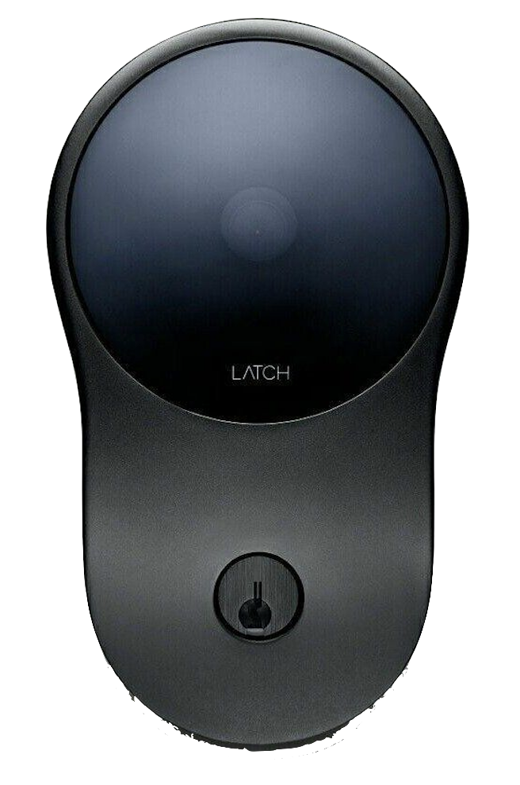
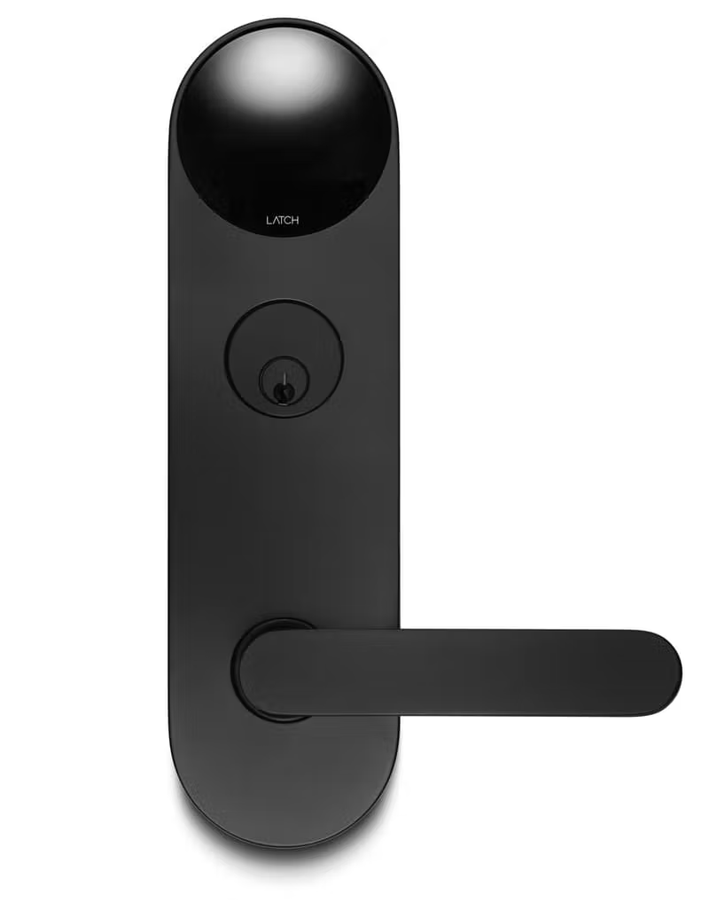
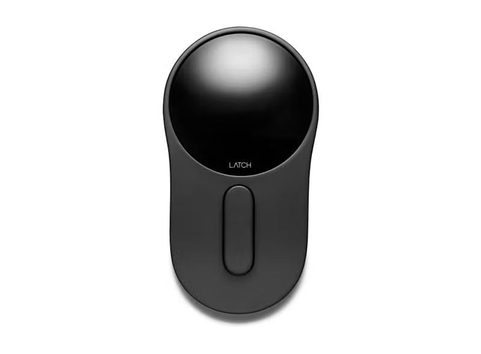
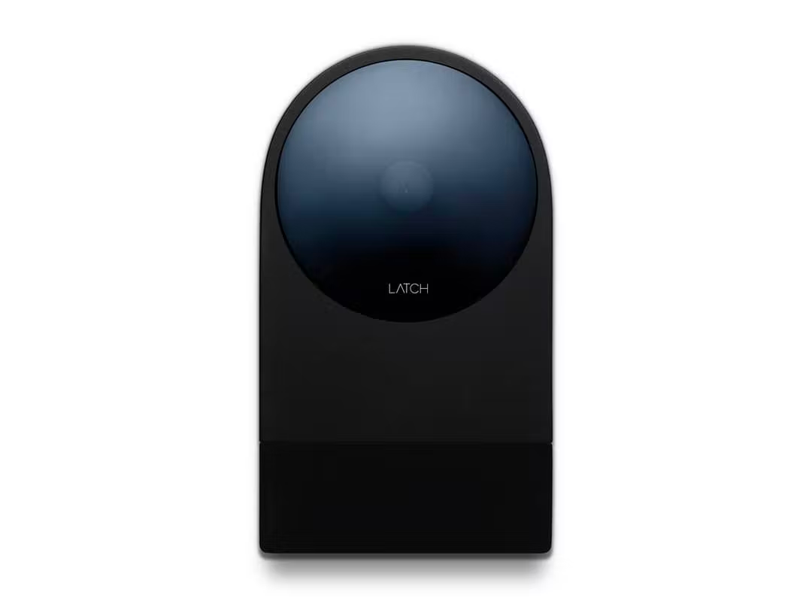

# Supported Devices

<table>
<tr>
  <th>C1</th>
  <th>M</th>
  <th>C2</th>
  <th>R2</th>
</tr>
<tr>
  <td bgcolor="#ffffff"></td>
  <td bgcolor="#ffffff"></td>
  <td bgcolor="#ffffff"></td>
  <td bgcolor="#ffffff"></td>
</tr>
<tr>
  <th colspan=4>Supported Firmwares</th>
</tr>
<tr>
  <td align="center">2.4.2</td>
  <td align="center">1.02</td>
  <td align="center">1.02</td>
  <td align="center">4.01</td>  
</tr>
</table>

## Supported Device Firmwares

The Latch SDK works with the most recent versions of the Latch devices. To upgrade your device to the latest firmware, please see instructions [here](https://support.latch.com/hc/en-us/articles/360011557853-Firmware-Upgrades).

