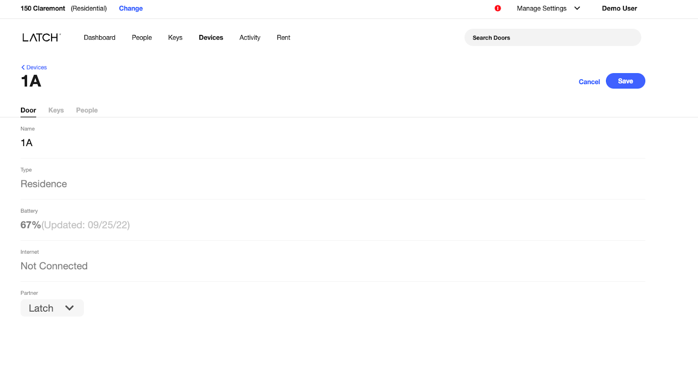

# User Kit

User Kit allows partners to programmatically grant users access to doors without the need of doing this via Latch Mission Control.

## Door Setup

The first step is for the customer to select which "doors" (as presented in Latch Mission Control) can be eligible to be used programmatically by a given partner.

After selecting a door, the property manager will select the partner from the dropdown, making it eligible for partners to use it via the APIs.

<table>
<tr><td></td></tr>
</table>


## Doors API

Partners can fetch a list of all the doors that are enabled for them, by using a partner-scoped token from the BE.
It is possible to filter results by Building UUID.

1. GET request from the Partner BE to the Latch BE with an empty body request

	```
	GET https://rest.latchaccess.com/access/sdk/v1/doors
	```

	HTTP Query Parameters

	```
	pageSize: <integer>   (by default returns all doors)
	pageToken: "<string>" (default is "1", first page)
	buildingUuid: "<string>" (for filtering results by the Building UUID)
	```

	HTTP Headers
	
	```
	Authorization: Bearer {{access_token}}
	```

	HTTP Request Body
	
	```
	<empty>
	```

	HTTP Response Body
	
    ```
    {
      "doors": [
        {
            "uuid": "<string>",
            "name": "<string>",
            "type": "DOOR" | "ELEVATOR",
            "buildingUuid": "<string>",
            "accessibilityType": "COMMUNAL | "PRIVATE",
            "isConnected": <boolean>,
            "device": {
                "serialNumber": "<string>",
                "type": "<string>",
                "battery": {
                    "percentage": <int32>,
                    "lastUpdated": <int64>
                }
            }
        },
        ...
      ],
      "nextPageToken": "<string>"
    }
    ```


1. If the request was successful, the Partner BE will receive an HTTP 200 with the following fields:

	* `doors`: List of "doors" and their metadata. Each entry will include:
      * `uuid`: Unique-identifier of the door.
      * `name`: Name of the door.
      * `type`: Type of door. Possible values: "DOOR" or "ELEVATOR".
      * `buildingUuid`: Unique-identifier of the building where the door is located.
      * `accessibilityType`: Indicates whether its a communal (entrance, amenities, etc.) or private door (e.g. unit)
      * `isConnected`: Indicates connection status of the door. If internet or hub connected, field is set to `true`.
      * `device`: Includes additional metadata about the physical lock device. **If null, it indicates the door is not yet activated.**
        * `serialNumber`: Serial number of the device.
        * `type`: Type of device. Possible values: 'M', 'R', 'R2', 'C', 'G'
        * `battery`: Battery information with the following fields:
          * `percentage`: Estimated percentage of battery left on the device.
          * `lastUpdated`: Indicates the last time the battery percentage was updated.
	* `nextPageToken`: Token to fetch the next page. Expected value is `null` when there is no next page.

	In case of an error, the API will return the following error responses:
	
	* `401 Unauthorized`: missing or invalid access token.

		⇒ Check the token hasn't expired and refresh the token if needed.
		
	* `500 Internal Server Error`: there was an unexpected error.

		⇒ Contact Latch Support

## Users API

### Get users

Partners can fetch a list of their Users. This will be done by using a partner-scoped token from the BE.

1. GET users request from the Partner BE to the Latch BE

    ```
    GET https://rest.latchaccess.com/access/sdk/v1/users
    ```

    HTTP Query Parameters

    ```
    pageSize: <integer> (default is 100)
    pageToken: "<string>" (default is "0", first page)
    ```

    HTTP Headers
	
    ```
    Authorization: Bearer {{access_token}}
    ```

    HTTP Request Body
	
    ```
    <empty>
    ```

    HTTP Response Body

    ```
    {
      "users": [
        {
          "email": "<string>",
          "firstName": "<string>",
          "lastName": "<string>",
          "userUuid": "<string>",
          "accesses": [
            {
              "doorUuid": "<string>",
              "passcodeType": "<string>",
              "shareable": <boolean>,
              "startTime": "<string>",
              "endTime": "<string>",
              "granter": {
                "type": "<string>",
                "uuid": "<string>"
              },
              "role": "<string>",
              "doorcode": {
                "code": "<string>",         // e.g. "1234567"
                "description": "<string>"
              }
            },
            ...
          ]
        },
        ...
      ],
      "nextPageToken": "<string>"
    }
    ```
	
2. If the request was successful, the Partner BE will receive an HTTP 200 containing a list of User objects, with the following fields:

    * `email`: Email address associated with the user.
    * `firstName`: First name of the user.
    * `lastName`: Last name of the user.
    * `userUuid`: Unique identifier of the user.
    * `accesses`: List of doors the user has access to with the following fields:
      * `doorUuid`: Unique identifier of the door.
      * `passcodeType`: Indicates access type. Possible values are `PERMANENT`, `DAILY`, `DAILY_SINGLE_USE`.
      * `shareable`: Indicates whether user can share access to guests.
      * `startTime`: Start time of access to door.
      * `endTime`: End time of access to door.
      * `granter`: Indicates who granted access to door. Possible values are `PARTNER`, `USER`.
      * `role`: Classifies a type of user. Possible values are `RESIDENT`, `NON_RESIDENT`.
      * `doorcode`: Doorcode object with the following fields:
        * `code`: 7 digit code for guest access to unlock the door. Can be `null`.
        * `description`: A message to explain the code result with the following possible values:
          * `VALID`: Indicates a valid 7 digit doorcode is returned.
          * `COMMUNAL_DOORCODE_CONFLICT`: Indicates a user has permanent access to public doors granted by a property manager in Mission Control in a property with the common doorcodes feature enabled. The `code` field is `null`.
          * `USER_HAS_RESIDENT_ACCESS`: Indicates the user has resident access to the door granted via UserKit or Mission Control. The `code` field is `null`.
          * `USER_HAS_GUEST_ACCESS_CONFLICT`: Indicates the user already has guest permanent access to the door granted via Mission Control. The `code` field is `null`.
    * `nextPageToken`: Token to fetch the next page. Expected value is `null` when there is no next page.

   In case of an error, the API will return the following error responses:
	
   * `401 Unauthorized`: missing or invalid access token.

     ⇒ Check the token hasn't expired and refresh the token if needed.
		
   * `500 Internal Server Error`: there was an unexpected error.

     ⇒ Contact Latch Support

### Create users and grant access

Partners can invite users, without the need of creating them ahead of time, and grant access to a set of doors. This will be done by using a partner-scoped token from the BE.

1. POST from the Partner BE to the Latch BE with the user and door information

	```
	POST https://rest.latchaccess.com/access/sdk/v1/users
	```

	HTTP Headers
	
	```
	Authorization: Bearer {{access_token}}
	```

	HTTP Request Body

   ```
   {
       "firstName": "<string>",
       "lastName": "<string>",
       "email": "<string>",
       "phone": "<string>",
       "startTime": "<datetime>",  // e.g. "2022-09-30T15:11:02.537Z"
       "endTime": "<datetime>",    // e.g. "2022-09-30T15:11:02.537Z"
       "doorUuids": [
         "<string>",
         ...
       ],
       "shareable": <boolean>,
       "passcodeType": "PERMANENT" | "DAILY" | "DAILY_SINGLE_USE",
       "role": "RESIDENT" | "NON_RESIDENT",
       "shouldNotify": <boolean>
   }
   ```
	
	HTTP Response Body
	
	```
	{
	    "userUuid": "<string>",
	    "doors": [
	      "uuid": "<string>"
	      "name": "<string>",
	      "type": "DOOR" | "ELEVATOR",
	      "buildingUuid": "<string>",
	    ]
	}
	```

#### Validation

| Passcode Type    | Type of Credential | Credential Details                                                                                                                                                    | Validation Notes                                                                                                                                                                                                                    | Downstream Notifications                                                                                                                                                                                                                                                        |
|------------------|--------------------|-----------------------------------------------------------------------------------------------------------------------------------------------------------------------|-------------------------------------------------------------------------------------------------------------------------------------------------------------------------------------------------------------------------------------|---------------------------------------------------------------------------------------------------------------------------------------------------------------------------------------------------------------------------------------------------------------------------------|
| PERMANENT        | Mobile Access      | Access via Latch Consumer App or Partner App                                                                                                                          | Email Required, Phone Optional                                                                                                                                                                                                      | Latch will send Guest a Latch Email Invite.                                                                                                                                                                                                                                     |
| DAILY            | Doorcode           | 7 digit doorcode that works for the entire calendar day set to the timezone of the device.End time from request is not used.                                          | Either email or phone required (not both). Start time must be either on the day of the request or the next day. No start time further in advance will be allowed. Exact start time on the day not honored. Shareable must be false. | If email is provided, Latch will email the doorcode. If phone is provided, Latch will text the doorcode unless an existing User is found with a matching phone number. If a User with that phone number is found and has an email address, Latch will send an email not a text. |
| DAILY_SINGLE_USE | Doorcode           | 7 digit doorcode that works for the entire calendar day set to the timezone of the device, but expires 15 minutes after first use. End time from request is not used. | Either email or phone required (not both). Start time must be either on the day of the request or the next day. No start time further in advance will be allowed. Shareable must be false.                                          | If email is provided, Latch will email the doorcode. If phone is provided, Latch will text the doorcode unless an existing User is found with a matching phone number. If a User with that phone number is found and has an email address, Latch will send an email not a text. |

Note that the `role` in the request does not bear relevance on the validation.
The `role` field allows clients to classify their understanding of a User's role with respect to a certain Door, but does not imply a certain credential type or shareability.
We currently support two `role`'s: `RESIDENT` and `NON_RESIDENT`.

In the future though, the `role` could be used to determine what credential details the Partner Backend has the ability to see.
For example, a Partner Backend can see credential details for their own `NON_RESIDENT`'s but not for `RESIDENT`'s as that would be a privacy violation.

####  Field descriptions

- `shouldNotify` (default `true`): controls whenever email notifications are sent to the invited user. The emails 
include the welcome email and/or the Doorcode email. If set to `false` **no** emails are sent. In order to prevent
invalid scenarios validations are put in place to prevent the following request situation since it would lead to the
user having no way of accessing their Doorcode:
  - `shouldNotify`: `false`
  - `passcodeType`: `DAILY` or `DAILY_SINGLE_USE`
  - `role`: `RESIDENT`

#### Results

1. If the request was successful, the Partner BE will receive an HTTP 200 with the following fields:

	* `userUuid`: Unique identifier of the invited user and the list of doors the user has access to:
		* `uuid`: Unique-identifier of the door.
		* `name`: Name of the door.
		* `type`: Type of door. Possible values: "DOOR" or "ELEVATOR".
		* `buildingUuid`: Unique-identifier of the building where the door is located.

	In case of an error, the API will return the following error responses:
	
	* `400 Bad Request`: missing/invalid parameters or invalid door UUIDs.

		⇒ Check all the parameters are correct and check all the given doors are valid. Ensure at least 1 doorUuid is supplied in the request.

	* `401 Unauthorized`: missing or invalid access token.

		⇒ Check the token hasn't expired and refresh the token if needed.

	* `500 Internal Server Error`: there was an unexpected error.

		⇒ Contact Latch Support

### Revoke access

Partners can revoke user access to given doors. This will be done by using a partner-scoped token from the BE.

1. DELETE from the Partner BE to the Latch BE with an empty body request.

	```
	DELETE https://rest.latchaccess.com/access/sdk/v1/users/:user/doors/:door
	```

	HTTP Headers
	
	```
	Authorization: Bearer {{access_token}}
	```

	HTTP Request Body
	
	```
	<empty>
	```

	HTTP Response Body
	
	```
	<empty>
	```

1. If the request was successful, the Partner BE will receive an HTTP 200 and an empty body response. In case of an error, the API will return the following error responses:

    * `404 Not Found`: invalid user or door UUIDs.

        ⇒ Check the user and door identifiers.
		
    * `401 Unauthorized`: missing or invalid access token.

        ⇒ Check the token hasn't expired and refresh the token if needed.
		
    * `500 Internal Server Error`: there was an unexpected error.

        ⇒ Contact Latch Support

### Get user

Partners can fetch a single user. This will be done by using a partner-scoped token from the BE.

1. GET user request from the Partner BE to the Latch BE with a valid user uuid.

    ```
    GET https://rest.latchaccess.com/access/sdk/v1/users/:user
    ```

    HTTP Headers
	
    ```
    Authorization: Bearer {{access_token}}
    ```

    HTTP Request Body
	
    ```
    <empty>
    ```

    HTTP Response Body

    ```
    {
       "email": "<string>",
       "firstName": "<string>",
       "lastName": "<string>",
       "userUuid": "<string>",
       "phone": "<string>"
       "accesses": [
         {
           "doorUuid: "<string>",
           "passcodeType": "<string>",
           "shareable": <boolean>,
           "startTime": "<string>",
           "endTime": "<string>",
           "granter": {
             "type": "<string>",
             "uuid": "<string>",
           },
           "role": "<string>",
           "doorcode": {
             "code": "<string>"          // e.g. "1234567"
             "description": "<string>"
           }
         },
         ...
       ]
    }
    ```
	
2. If the request was successful, the Partner BE will receive an HTTP 200 containing a User object, with the following fields:

    * `email`: Email address associated with the user.
    * `firstName`: First name of the user.
    * `lastName`: Last name of the user.
    * `userUuid`: Unique identifier of the user.
    * `phone`: Phone number of the user. Can be `null`.
    * `accesses`: List of doors the user has access to with the following fields:
      * `doorUuid`: Unique identifier of the door.
      * `passcodeType`: Indicates access type. Possible values are `PERMANENT`, `DAILY`, `DAILY_SINGLE_USE`.
      * `shareable`: Indicates whether user can share access to guests.
      * `startTime`: Start time of access to door.
      * `endTime`: End time of access to door.
      * `granter`: Indicates who granted access to door. Possible values are `PARTNER`, `USER`.
      * `role`: Classifies a type of user. Possible values are `RESIDENT`, `NON_RESIDENT`.
      * `doorcode`: Doorcode object with the following fields:
        * `code`: 7 digit code for guest access to unlock the door. Can be `null`.
        * `description`: A message to explain the code result with the following possible values:
          * `VALID`: Indicates a valid 7 digit doorcode is returned.
          * `COMMUNAL_DOORCODE_CONFLICT`: Indicates a user has permanent access to public doors granted by a property manager in Mission Control in a property with the common doorcodes feature enabled. The `code` field is `null`.
          * `USER_HAS_RESIDENT_ACCESS`: Indicates the user has resident access to the door granted via UserKit or Mission Control. The `code` field is `null`.
          * `USER_HAS_GUEST_ACCESS_CONFLICT`: Indicates the user already has guest permanent access to the door granted via Mission Control. The `code` field is `null`.

   In case of an error, the API will return the following error responses:
	
   * `401 Unauthorized`: missing or invalid access token.

   ⇒ Check the token hasn't expired and refresh the token if needed.

   * `404 Not Found`: invalid user.
	
   ⇒ Check the user identifier.
		
   * `500 Internal Server Error`: there was an unexpected error.

   ⇒ Contact Latch Support

### Patch access

Partners can update user access to given doors. This will be done by using a partner-scoped token from the BE.

1. PATCH user request from the Partner BE to the Latch BE with valid user and door uuid.

    ```
    PATCH https://rest.latchaccess.com/access/sdk/v1/users/:user/doors/:door
    ```

   HTTP Headers

    ```
    Authorization: Bearer {{access_token}}
    ```

   HTTP Request Body

    ```
    {
       "shareable": <boolean>,
       "endTime": "<string>"
    }
    ```

   HTTP Response Body

    ```
    {
       "email": "<string>",
       "firstName": "<string>",
       "lastName": "<string>",
       "userUuid": "<string>",
       "phone": "<string>"
       "accesses": [
         {
           "doorUuid: "<string>",
           "passcodeType": "<string>",
           "shareable": <boolean>,
           "startTime": "<string>",
           "endTime": "<string>",
           "granter": {
             "type": "<string>",
             "uuid": "<string>",
           },
           "role": "<string>",
           "doorcode": {
             "code": "<string>"          // e.g. "1234567"
             "description": "<string>"
           }
         },
         ...
       ]
    }
    ```

#### Field Descriptions
- Keep in mind that if `endTime` is omitted from the request body, the api will treat it as if the `endTime` was
explicitly set to `null`. This is expected in order to support requests to remove expiration from access. To
keep the existing `endTime`, simply add it to the request body.

#### Results
2. If the request was successful, the Partner BE will receive an HTTP 200 containing a User object, with the following fields:

    * `email`: Email address associated with the user.
    * `firstName`: First name of the user.
    * `lastName`: Last name of the user.
    * `userUuid`: Unique identifier of the user.
    * `phone`: Phone number of the user. Can be `null`.
    * `accesses`: List of doors the user has access to with the following fields:
        * `doorUuid`: Unique identifier of the door.
        * `passcodeType`: Indicates access type. Possible values are `PERMANENT`, `DAILY`, `DAILY_SINGLE_USE`.
        * `shareable`: Indicates whether user can share access to guests.
        * `startTime`: Start time of access to door.
        * `endTime`: End time of access to door.
        * `granter`: Indicates who granted access to door. Possible values are `PARTNER`, `USER`.
        * `role`: Classifies a type of user. Possible values are `RESIDENT`, `NON_RESIDENT`.
        * `doorcode`: Doorcode object with the following fields:
            * `code`: 7 digit code for guest access to unlock the door. Can be `null`.
            * `description`: A message to explain the code result with the following possible values:
                * `VALID`: Indicates a valid 7 digit doorcode is returned.
                * `COMMUNAL_DOORCODE_CONFLICT`: Indicates a user has permanent access to public doors granted by a property manager in Mission Control in a property with the common doorcodes feature enabled. The `code` field is `null`.
                * `USER_HAS_RESIDENT_ACCESS`: Indicates the user has resident access to the door granted via UserKit or Mission Control. The `code` field is `null`.
                * `USER_HAS_GUEST_ACCESS_CONFLICT`: Indicates the user already has guest permanent access to the door granted via Mission Control. The `code` field is `null`.

   In case of an error, the API will return the following error responses:

    * `400 Bad Request`: invalid request
   
   ⇒ Check endTime is after current and start time. 

    * `401 Unauthorized`: missing or invalid access token.

   ⇒ Check the token hasn't expired and refresh the token if needed.

    * `404 Not Found`: invalid user or door UUIDs.

   ⇒ Check the user and door identifiers. Also check user has permanent access to the given door.

    * `500 Internal Server Error`: there was an unexpected error.

   ⇒ Contact Latch Support

## Buildings API

### Get buildings

Partners can fetch a list of their Buildings. This will be done by using a partner-scoped token from the BE.

1. GET request from the Partner BE to the Latch BE with an empty body request

   ```
   GET https://rest.latchaccess.com/access/sdk/v1/buildings
   ```

   HTTP Headers

   ```
   Authorization: Bearer {{access_token}}
   ```

   HTTP Request Body

   ```
   <empty>
   ```

   HTTP Response Body

   ```
   {
       "buildings": [
         {
            "uuid": "<string>",
            "name": "<string>",
            "address": {
              "addressLine1": "<string>",
              "addressLine2": "<string>",
              "addressLine3": "<string>",
              "city": "<string>",
              "country": "<string>",
              "postalCode": "<string>",
              "state": "<string>",
              "portfolio": {
                "uuid": "<string>",
                "name": "<string>"
              }
            }
         },
         ...
       ]
   }
   ```


2. If the request was successful, the Partner BE will receive an HTTP 200 with the following fields:

    * `buildings`: List of "buildings" and their metadata. Each entry will include:
        * `uuid`: Unique-identifier of the building.
        * `name`: Name of the building.
        * `address`: Location the building is located.
        * `portfolio`: Includes the name and uuid of the portfolio the building is part of.

   In case of an error, the API will return the following error responses:

    * `401 Unauthorized`: missing or invalid access token.

      ⇒ Check the token hasn't expired and refresh the token if needed.

    * `500 Internal Server Error`: there was an unexpected error.

      ⇒ Contact Latch Support