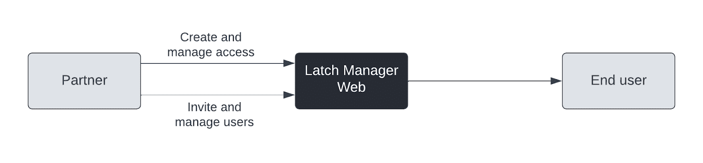
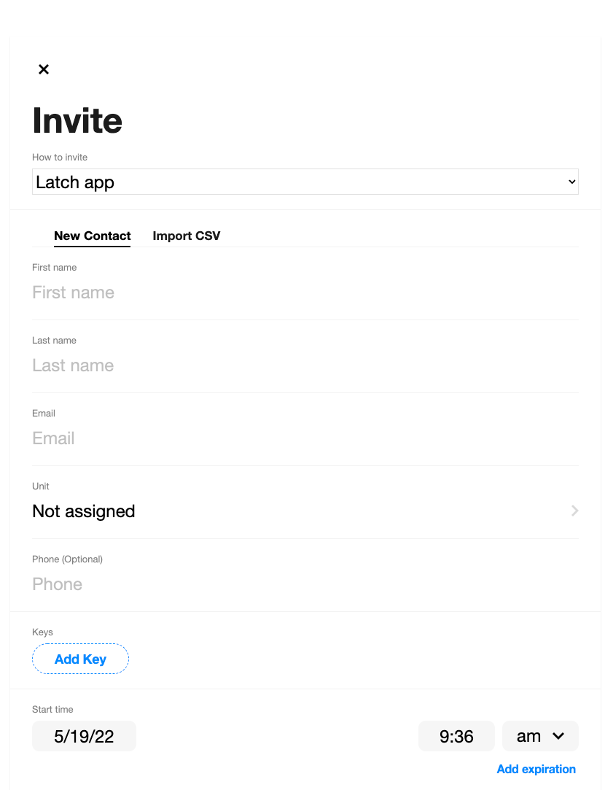
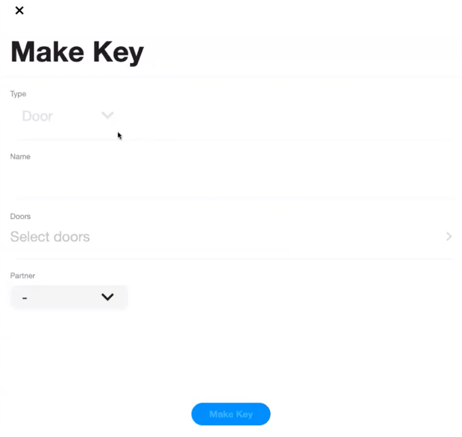

# User Management - Latch (Non User Kit)

Customers will have access to the Latch Manager Web to create and manage users. To create a user, a Customer will need to provide a minimum of:

* First Name
* Last Name
* Email
* Key with Start and End Access time

Once a user is invited to Latch, a confirmation notification will be delivered to the user’s email address informing the user that an account has been created for them at Latch. While not required to utilize the Partner App and Latch SDK, the user will have the option from the email notification to finalize setting up their Latch account by creating a Latch password. 

Having a Latch Account/Password, enables the user to utilize the Latch app and participate in other Partner Apps that are part of the Latch ecosystem. 

> Anytime a user is invited to Latch either directly or through a Partner, a confirmation email is sent to the user. User’s can take the optional step of finalizing the Latch account by creating a password enabling them to utilize the Latch App.

Creating a Latch account password and subsequently utilizing the Latch App is a purely optional step by the user and is not a requirement to utilize the Partner App.  

## Keys

Keys are a grouping of doors with settings that are provided to end users in order to provide access to a device and can be created for one or more doors from within the Latch Manager Web. When a Key is created, an authorized user from the Customer will also need to assign the Key to be accessible by a Partner.

## Customer Setup

A Customer will need to set up doors, have them activated by an installer, create keys, enable those keys and invite users on behalf of the Partner. Later this year when our User Kit goes live, partners will be able to automate the invitation of users themselves. Customers can work with Latch directly to set their property up properly. If a partner is also a customer, these steps are still required but can be done by the same entity. For more information on setting up your portfolio please see more information [here](https://support.latch.com/hc/en-us/sections/360001650373-Getting-Started). For the Latch SDK, the assignment of a Key to a Partner is the only change to management of the portfolio. 

> Keys can only be assigned to a single Partner, however Customers can create as many keys as needed. Until a Key is assigned to a Partner, the end user will be unable to unlock the associated Latch device through the Partner’s App.

For an existing Portfolio Key, Latch Manager Web is unable to support changes at this time and requires the Customer to create a new Key. However since this is a well known issue, Latch Engineering teams are working to correct and will be addressed in a coming release. 
